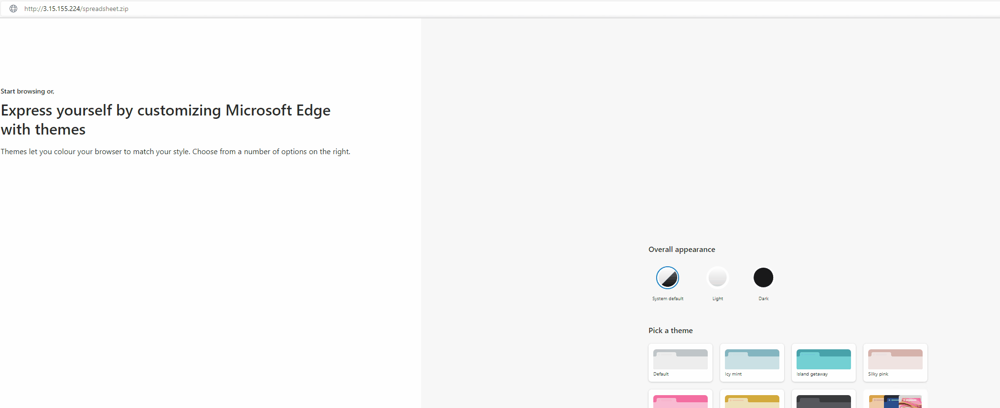

# XLL_Phishing

## Introduction
With Microsoft's [recent announcement](https://docs.microsoft.com/en-us/deployoffice/security/internet-macros-blocked) regarding the blocking of macros in documents originating from the internet (email AND web download), attackers have began aggressively exploring other options to achieve user driven access (UDA). There are several considerations to be weighed and balanced when looking for a viable phishing for access method:

1. Complexity - The more steps that are required on the user's part, the less likely we are to be successful. 
2. Specificity - Are most victim machines susceptible to your attack? Is your attack architecture specific? Does certain software need to be installed?
3. Delivery - Are there network/policy mitigations in place on the target network that limit how you could deliver your maldoc? 
4. Defenses - Is application whitelisting enforced?
5. Detection - What kind of AV/EDR is the client running?

These are the major questions, however there are certainly more.  Things get more complex as you realize that these factors compound each other; for example, if a client has a web proxy that prohibits the download of executables or DLL's, you may need to stick your payload inside a container (ZIP, ISO, etc).  Doing so can present further issues down the road when it comes to detection.  More robust defenses require more complex combinations of techniques to defeat.

This article will be written with a fictional target organization in mind;  this organization has employed several defensive measures including email filtering rules, blacklisting certain file types from being downloaded, application whitelisting on endpoints, and Microsoft Defender for Endpoint as an EDR solution. 

Real organizations may employ none of these, some, or even more defenses which can simplify or complicate the techniques outlined in this research.  As always, know your target. 

## What are XLL's?

XLL's are DLL's, specifically crafted for Microsoft Excel. To the untrained eye they look a lot like normal excel documents.

XLL's provide a very attractive option for UDA given that they are executed by Microsoft Excel, a very commonly encountered software in client networks; as an additional bonus, because they are executed by Excel, our payload will almost assuredly bypass Application Whitelisting rules because a trusted application (Excel) is executing it. XLL's can be written in C, C++, or C# which provides a great deal more flexibility and power (and sanity) than VBA macros which further makes them a desirable choice. 

The downside of course is that there are very few legitimate uses for XLL's, so it SHOULD be a very easy box to check for organizations to block the download of that file extension through both email and web download. Sadly many organizations are years behind the curve and as such XLL's stand to be a viable method of phishing for some time.

There are a series of different events that can be used to execute code within an XLL, the most notable of which is xlAutoOpen.  The full list may be seen [here](https://docs.microsoft.com/en-us/office/client-developer/excel/add-in-manager-and-xll-interface-functions): 

Upon double clicking an XLL, the user is greeted by this screen:

This single dialog box is all that stands between the user and code execution; with fairly thin social engineering, code execution is all but assured.

Something that must be kept in mind is that XLL's, being executables, are **architecture specific**.  This means that you must know your target; the version of Microsoft Office/Excel that the target organization utilizes will (usually) dictate what architecture you need to build your payload for.

There is a pretty clean break in Office versions that can be used as a rule of thumb:

Office 2016 or earlier: x86

Office 2019 or later: x64

It should be noted that it is possible to install the other architecture for each product, however these are the default architectures installed and in most cases this should be a reliable way to make a decision about which architecture to roll your XLL for.  Of course depending on the delivery method and pretexting used as part of the phishing campaign, it is possible to provide both versions and rely on the victim to select the appropriate version for their system.

### Resources
The XLL payload that was built during this research was based on [this](https://github.com/edparcell/HelloWorldXll) project by edparcell.  His repository has good instructions on getting started with XLL's in Visual Studio, and I used his code as a starting point to develop a malicious XLL file.  

A notable deviation from his repository is that should you wish to create your own XLL project, you will need to download the [latest Excel SDK](https://docs.microsoft.com/en-us/office/client-developer/excel/welcome-to-the-excel-software-development-kit) and then follow the instructions on the previously linked repo using this version as opposed to the 2010 version of the SDK mentioned in the README. 

## Delivery
Delivery of the payload is a serious consideration in context of UDA.  There are two primary methods we will focus on:

1. Email Attachment
2. Web Delivery

### Email Attachment
Either via attaching a file or including a link to a website where a file may be downloaded, email is a critical part of the UDA process. Over the years many organizations (and email providers) have matured and enforced rules to protect users and organizations from malicious attachments.  Mileage will vary, but organizations now have the capability to:

1. Block executable attachments (EXE, DLL, XLL, MZ headers overall)
2. Block containers like ISO/IMG which are mountable and may contain executable content
3. Examine zip files and block those containing executable content
4. Block zip files that are password protected
5. More

Fuzzing an organization's email rules can be an important part of an engagement, however care must always be taken so as to not tip one's hand that a Red Team operation is ongoing and that information is actively being gathered.

For the purposes of this article, it will be assumed that the target organization has robust email attachment rules that prevent the delivery of an XLL payload.  We will pivot and look at web delivery.

### Web Delivery
Email will still be used in this attack vector, however rather than sending an attachment it will be used to send a link to a website.  Web proxy rules and network mitigations controlling allowed file download types can differ from those enforced in regards to email attachments.  For the purposes of this article, it is assumed that the organization prevents the download of executable files (MZ headers) from the web.  This being the case, it is worth exploring [packers/containers](https://github.com/mgeeky/PackMyPayload).  

The premise is that we might be able to stick our executable inside another file type and smuggle it past the organization's policies. A major consideration here is native support for the file type; 7Z files for example cannot be opened by Windows without installing third party software, so they are not a great choice.  Formats like ZIP, ISO, and IMG are attractive choices because they are supported natively by Windows, and as an added bonus they add very few extra steps for the victim.

The organization unfortunately blocks ISO's and IMG's from being downloaded from the web; additionally, because they employ Data Loss Prevention (DLP) users are unable to mount external storage devices, which ISO's and IMG's are considered.  

Luckily for us, even though the organization prevents the download of MZ-headered files, it does allow the download of zip files containing executables.  These zip files are actively scanned for malware, to include prompting the user for the password for password-protected zip files; however because the executable is zipped it is not blocked by the otherwise blanket deny for MZ files.

## Zip files and execution
Zip files were chosen as a container for our XLL payload because:

1. They are natively compatible with Windows
2. They are allowed to be downloaded from the internet by the organization
3. They add very little additional complexity to the attack

Conveniently, double clicking a ZIP file on Windows will open that zip file in File Explorer:

Less conveniently, double clicking the XLL file from the zipped location triggers Windows Defender; even using the stock project from edparcell that doesn't contain any kind of malicious code.

Looking at the Windows Defender alert we see it is just a generic "Wacatac" alert:

However there is something odd; the file it identified as malicious was in c:\users\user\Appdata\Local\Temp\Temp1_ZippedXLL.zip\, not C:\users\user\Downloads\ZippedXLL\ where we double clicked it. Looking at the Excel instance in ProcessExplorer shows that Excel is actually running the XLL from appdata\local\temp, not from the ZIP file that it came in:

This appears to be a wrinkle associated with ZIP files, not XLL's.  Opening a TXT file from within a zip using notepad also results in the TXT file being copied to appdata\local\temp and opened from there.  While opening a text file from this location is fine, Defender seems to identify **any** sort of actual code execution in this location as malicious.  

If a user were to extract the XLL from the ZIP file and then run it, it will execute without any issue; however there is no way to guarantee that a user does this, and we really can't roll the dice on popping AV/EDR should they not extract it.  Besides, double clicking the ZIP and then double clicking the XLL is far simpler and a victim is far more prone to complete those simple actions than go to the trouble of extracting the ZIP. 

This problem caused me to begin considering a different payload type than XLL; I began exploring [VSTO's](https://medium.com/@airlockdigital/make-phishing-great-again-vsto-office-files-are-the-new-macro-nightmare-e09fcadef010), which are Visual Studio Templates for Office. I highly encourage you to check out that article.

VSTO's ultimately call a DLL which can either be located locally with the .XLSX that initiates everything, or hosted remotely and downloaded by the .XLSX via http/https.  The local option provides no real advantages (and in fact several disadvantages in that there are several more files associated with a VSTO attack), and the remote option unfortunately requires a code signing certificate or for the remote location to be a trusted network.  Not having a valid code signing cert, VSTO's 
do not mitigate any of the issues in this scenario that our XLL payload is running into.

We really seem to be backed into a corner here.  Running the XLL itself is fine, however the XLL cannot be delivered by itself to the victim either via email attachment or web download due to organization policy.  The XLL needs to be packaged inside a container, however due to DLP formats like ISO, IMG, and VHD are not viable.  The victim needs to be able to open the container natively without any third party software, which really leaves ZIP as the option; however as discussed, running the XLL from a zipped folder results in it being copied and ran from appdata\local\temp which flags AV.  

I spent many hours brain storming and testing things, going down the VSTO rabbit hole, exploring all conceivable options until I finally decided to try something so dumb it just might work.

This time I created a folder, placed the XLL inside it, and then zipped the folder:

Clicking into the folder reveals the XLL file:

Double clicking the XLL shows the Add-In prompt from Excel.  Note that the XLL is still copied to appdata\local\temp, however there is an additional layer due to the extra folder that we created:

Clicking enable executes our code without flagging Defender:

Nice! Code execution.  Now what?

## Tradecraft

The pretexting involved in getting a victim to download and execute the XLL will vary wildly based on the organization and delivery method; themes might include employee salary data, calculators for compensation based on skillset, information on a project, an attendee roster for an event, etc. Whatever the lure, our attack will be a lot more effective if we actually provide the victim with what they have been promised.  Without follow through, victims may become suspicious and report the document to their security teams which can quickly give the attacker away and curtail access to the target system.

The XLL by itself will just leave a blank Excel window after our code is done executing; it would be much better for us to provide the Excel Spreadsheet that the victim is looking for. 

There are a few ways to do this.  We could include the XLSX spreadsheet in the ZIP file as a hidden file and have our code open the XLSX; however this could cause confusion or problems if the victim has the option to display hidden files enabled in File Explorer.  Alternatively we could embed our XLSX as as byte array inside the XLL; when the XLL executes, it could drop the XLSX to disk beside the XLL after which it could be opened. In either case we will name the XLSX the same as the XLL, the only difference being the extension. 

Given that our XLL is written in C, we can bring in some of the capabilities from a previous writeup I did on [Payload Capabilities in C](https://github.com/Octoberfest7/Mutants_Sessions_Self-Deletion), namely Self-Deletion.  Combining these two techniques results in the XLL being deleted from disk, and the XLSX of the same name being dropped in it's place.  To the undiscerning eye, it will appear that the XLSX was there the entire time.

Unfortunately the location where the XLL is deleted and the XLSX dropped is the appdata\temp\local folder, not the original ZIP; to address this we can create a second ZIP containing the XLSX alone and also read it into a byte array within the XLL.  On execution in addition to the aforementioned actions, the XLL could try and locate the original ZIP file in c:\users\<victim>\Downloads\ and delete it before dropping the second ZIP containing just the XLSX in it's place. This could of course fail if the user saved the original ZIP in a different location or under a different name, however in many/most cases it should drop in the user's downloads folder automatically. 

This screenshot shows in the lower pane the temp folder created in appdata\local\temp containing the XLL and the dropped XLSX, while the top pane shows the original File Explorer window from which the XLL was opened.  Notice in the lower pane that the XLL has size 0. This is because it deleted itself during execution, however until the top pane is closed the XLL file will not completely disappear from the appdata\local\temp location.  Even if the victim were to click the XLL again, it is now inert and does not really exist.  

Similarly, as soon as the victim backs out of the opened ZIP in File Explorer (either by closing it or navigating to a different folder), should they click spreadsheet.zip again they will now find that the test folder contains importantdoc.xlsx; so the XLL has been removed and replaced by the harmless XLSX in both locations that it existed on disk.

This GIF demonstrates the download and execution of the XLL on an MDE trial VM.  Note that for some reason Excel opens two instances here; on my home computer it only opened one, so not quite sure why that differs.

## Detection

As always, we will ask "What does MDE see?"

A quick screenshot dump to prove that I did execute this on target and catch a beacon back on TestMachine11:

First off, zero alerts:

What does the timeline/event log capture?

Yikes. Truth be told I have no idea where the keylogging, encrypting, and decrypting credentials alerts are coming from as my code doesn't do any of that.  Our actions sure look suspicious when laid out like this, but I will again comment on just how much data is collected by MDE on a single endpoint, let alone hundreds, thousands, or hundreds of thousands that an organization may have hooked into the EDR.  So long as we aren't throwing any actual alerts, we are probably ok.

## Code Sample
The moment most have probably been waiting for, I am providing a code sample of my developed XLL runner, limited to just those parts discussed here in the Tradecraft section.  It will be on the reader to actually get the code into an XLL and implement it in conjunction with the rest of their runner.  As always, do no harm, have permission to phish an organization, etc. 

## Conclusion
With the dominance of Office Macro's coming to a close, XLL's present an attractive option for phishing campaigns.  With some creativity they can be used in conjunction with other techniques to bypass many layers of defenses implemented by organizations and security teams.  Thank you for reading and I hope you learned something useful!
